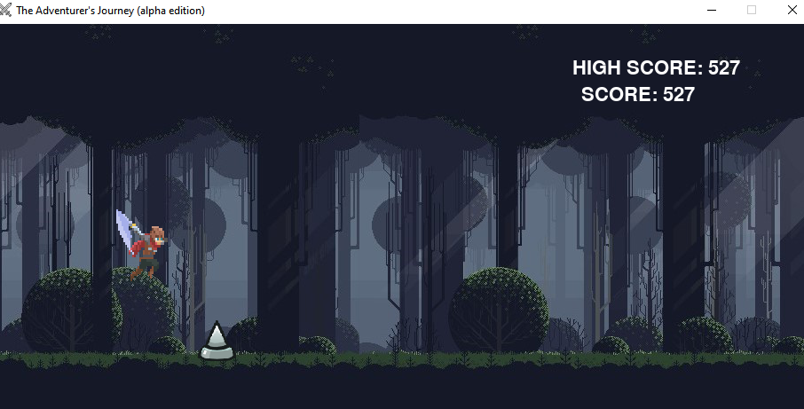

# 🏃 The Adventurer's Journey

Este é um jogo de aventura em que o jogador deve controlar um personagem enquanto ele corre para escapar de perigosos obstáculos. O jogo é inspirado no famoso jogo do Dino Runner, que é exibido quando a internet está indisponível.

# 🎮 Como jogar

Para jogar, basta executar o arquivo `main.py`. Use a tecla de espaço, W ou a Seta p/ cima para fazer o personagem pular e evite os obstáculos para continuar correndo, para agachar você pode utilizar o CTRL, S ou Seta p/ baixo. O jogo é infinito, portanto, a dificuldade aumentará gradualmente à medida que você avança. E utilizando a Tecla D ou a Seta p/ direita você pode atacar os Obstáculos.

# 🛠️ Requisitos

O jogo foi construído usando a biblioteca Pygame para Python, portanto, é necessário ter o Python 3 e o Pygame instalados em seu sistema. Você pode instalar o Pygame executando o seguinte comando em seu terminal:

`pip install pygame`

# 🤝 Contribuições

Este jogo é um projeto feito em Grupo para o Módulo 2 e não é mantido ativamente, mas contribuições são bem-vindas! Sinta-se à vontade para fazer um fork deste repositório e fazer melhorias ou correções de bugs. Abra uma issue se tiver alguma ideia ou problema a ser discutido.

# 📜 Licença

Este projeto está sob a licença MIT. Sinta-se à vontade para usá-lo como base para seus próprios projetos.

# 👨‍💻 Equipe

◉ João Guedes
◉ Mariano Queiroz
◉ Diego Nascimento
◉ Erick Roberto
